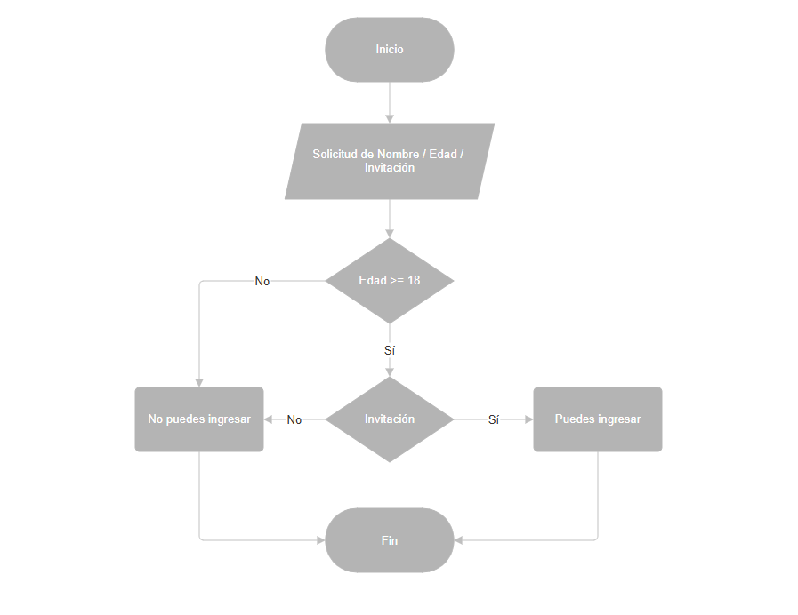

# 🚀 Reto 1: Sistema de Control de Acceso

¡Bienvenidos mi primer reto de programación! Este proyecto implementa un sistema básico de validación de acceso, siguiendo las reglas de negocio especificadas.

## 📋 Contexto del Reto

El objetivo principal fue desarrollar una aplicación que simule el control de acceso a un evento. Para esto, el sistema interactúa con el usuario, solicitando información para determinar si cumple con las condiciones para lograr ingresar. siendo mayor de 18 años y que cuente con una invitación.

## ✨ Funcionalidades

El sistema de control de acceso se basa en la siguiente lógica que presento en este diagrama:

## ✍️ Autor

* **Duwar Alexander Rippe Amaya**