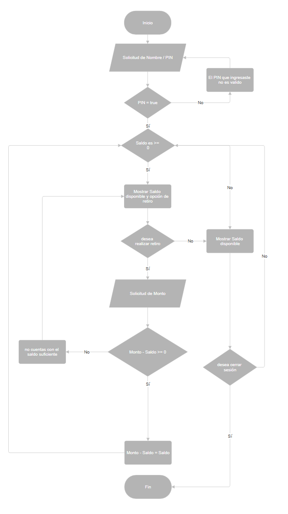

# 🏧 Reto 2: Simulador de Cajero Automático

¡Bienvenidos mi segundo reto! Este proyecto es una simulación de un cajero automático, diseñado para poner a prueba la lógica de negocio, la gestión de estado y la interacción con el usuario.

## 📋 Contexto del Reto

El objetivo de este proyecto es recrear las funcionalidades esenciales de un cajero automático. El sistema debe validar el acceso del usuario a través de un PIN y, una vez dentro, permitirle realizar operaciones básicas como consultar su saldo y realizar retiros. en donde reincia el saldo incial solo al cerrar la sesión.

El pin es: **1234**

## ✨ Funcionalidades

El simulador de cajero automático lo base en la siguiente lógica que presento en este diagrama:

## ✍️ Autor

* **Duwar Alexander Rippe Amaya**