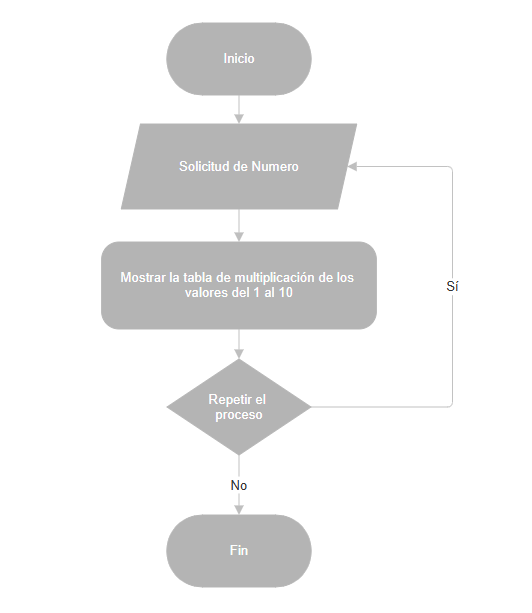

# 📊 Reto 3: Generador Interactivo de Tablas de Multiplicar

¡Tercer reto completado! Este proyecto es un generador de tablas de multiplicar, con un enfoque en la interactividad y la repetición controlada por el usuario.

## 📋 Contexto del Reto

El objetivo principal fue desarrollar una herramienta simple que, dado un número, sea capaz de mostrar su tabla de multiplicar completa. La clave de este reto es la capacidad del programa para interactuar con el usuario, permitiéndole generar múltiples tablas en una misma sesión. son numeros positivos mayores a 0.

## ✨ Funcionalidades

El generador de tablas de multiplicar se basa en la siguiente lógica que presento en este diagrama:

## ✍️ Autor

* **Duwar Alexander Rippe Amaya**